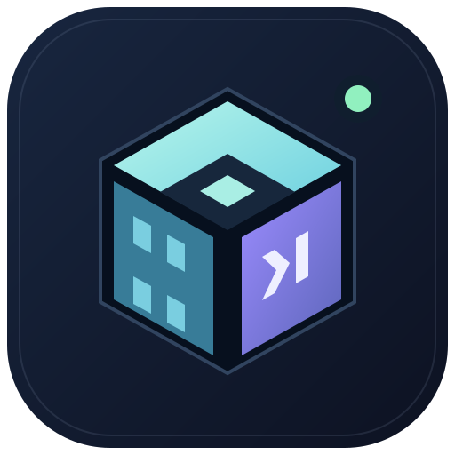
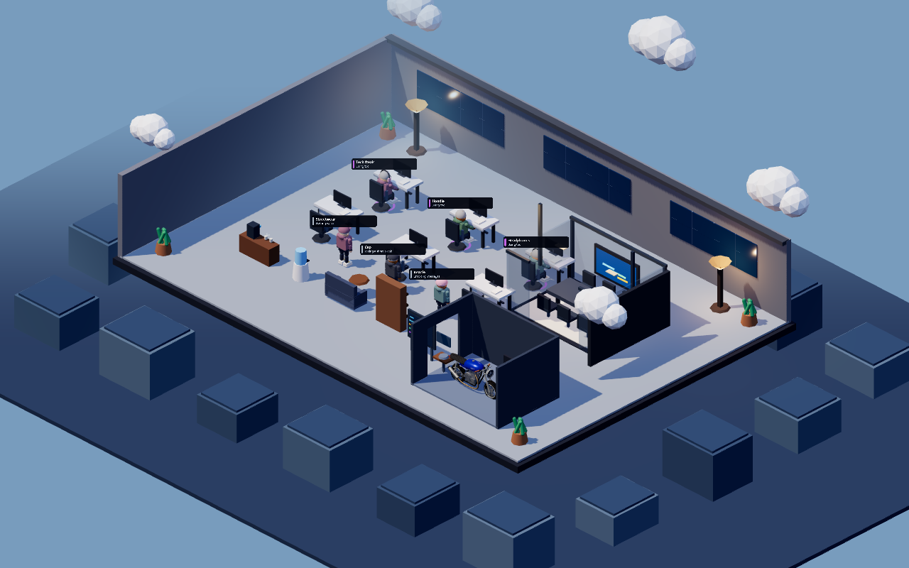

<p align="center">
  
</p>

<h1 align="center">OfficeAI</h1>
<p align="center"><strong>Your agents. One living workspace.</strong><br />
Kantor 3D untuk memantau AI dan mengirim instruksi dari HP.</p>

<p align="center">
  <a href="#install-desktop">Install desktop</a> ·
  <a href="#android">Android</a> ·
  <a href="#prompt-agent-yang-sudah-jalan">Kontrol agent</a> ·
  <a href="docs/OFFICE_UPGRADE_PLAN.md">Plan & acceptance gates</a>
</p>

<p align="center"><br /><sub>Preview lokal dengan agent simulasi; status penggunaan asli berasal dari desktop.</sub></p>

## Tentang OfficeAI

OfficeAI mengubah aktivitas AI menjadi kantor virtual: satu agent, satu karakter.
Saat bekerja, karakter duduk di meja. Saat idle, mereka berkeliling, istirahat,
membuat kopi, merokok, atau mengoprek café racer biru di garasi.

Versi ini dikembangkan oleh **nox14**: kantor modern, karakter muda bergaya
hoodie/streetwear, dan companion Android dengan renderer Three.js yang sama.
Bukan video streaming desktop dan bukan replika 2D di HP.

### Yang ada sekarang

| Fitur | Perilaku |
| --- | --- |
| Avatar original ber-rig | Hoodie, topi, beanie, headset, kacamata, dan gaya tech freak; fashion konsisten berdasarkan ID agent |
| Animasi | Idle, jalan, duduk, kerja, merokok, dan reparasi motor; crossfade antarpose |
| Kantor 3D | Meja modern, meeting room kaca, lounge, coffee station, dispenser, garasi, dan city backdrop |
| Navigasi | Rute menghindari furnitur dan dinding; kaki bergerak mengikuti kecepatan jalan |
| Desktop + Android | Model dan geometri kantor dari satu renderer; kamera bisa diputar, di-zoom, di-reset, atau difokuskan ke agent |
| Kontrol agent aktif | Attach ke window Kitty atau pane tmux yang identitasnya terverifikasi |
| Composer HP | Kirim saat siap, antrekan saat sibuk, interrupt dengan konfirmasi; draft tidak dihapus jika kirim gagal |
| Timeline | Status, tool, respons, error, dan receipt pengiriman; diperbarui selama sheet terbuka |

Status kerja berasal dari proses dan log agent, **bukan animasi sibuk yang dibuat-buat**.
Keakuratan aktivitas bergantung pada format log provider dan sesi yang terdeteksi.

## Install desktop

Pengguna paket release tidak perlu Node.js, Rust, atau menjalankan dev server.
Library sistem tetap diperlukan; package manager akan memasang dependency yang tercantum.

### Arch Linux / Manjaro

Gunakan paket Arch, **bukan** `.deb`:

```bash
sudo pacman -U ./officeai-0.1.0-6-x86_64.pkg.tar.zst
officeai
```

OfficeAI muncul di app launcher. Untuk uninstall:

```bash
sudo pacman -R officeai
```

Jika membangun dari source:

```bash
sudo pacman -S --needed base-devel nodejs npm rust webkit2gtk-4.1 gtk3
git clone https://github.com/raffinauvall/ai-agent-workspace.git
cd ai-agent-workspace
npm ci
CARGO_BUILD_JOBS=2 npm run build:desktop
cd packaging/arch
makepkg --force
sudo pacman -U ./officeai-0.1.0-6-x86_64.pkg.tar.zst
```

Node.js 22+ dan Rust diperlukan hanya untuk build. Jika memakai rustup, aktifkan
environment Cargo sebelum build: `source "$HOME/.cargo/env"`.
`CARGO_BUILD_JOBS=2` membatasi paralelisme compile pada laptop, bukan penggunaan CPU aplikasi.
Jangan memakai `cargo build --release` tanpa `--features custom-protocol`:
profil release saja masih memakai URL Vite. `npm run build:desktop` menyertakan
frontend ke binary, sehingga app terpasang tidak membutuhkan server dev.

### Ubuntu / Debian

Build paket distro ini dari source dengan dependency
[Tauri Linux](https://v2.tauri.app/start/prerequisites/#linux):

```bash
npm ci
npm run tauri -- build --bundles deb
```

Hasil ada di `src-tauri/target/release/bundle/deb/`.
Buka `.deb` dengan installer paket desktop jika tersedia, atau gunakan
`sudo apt install ./NAMA_PAKET.deb`. `.deb` tidak ditujukan untuk Arch.

### Windows / macOS

Source Tauri menyediakan target installer Windows dan macOS. Build pada OS target
dengan prerequisite Tauri yang sesuai. **Build dan attach terminal versi ini
diverifikasi di Linux; attach Kitty/tmux belum tersedia di Windows/macOS.**
Jangan menganggap file Linux bisa dipasang di Windows.

## Mulai memakai desktop

1. Buka OfficeAI dari launcher atau jalankan `officeai`.
2. Jalankan CLI AI di terminal. Agent lokal yang didukung akan terdeteksi.
3. Klik karakter atau daftar agent untuk melihat workspace, status, dan timeline.
4. Putar kamera dengan drag; scroll/pinch untuk zoom. Drag tidak dianggap sebagai tap karakter.
5. Untuk akses HP, buka **Remote → Buka tunnel**, lalu salin URL dan token.

Agent CLI yang didukung untuk attach saat ini: **Codex, Claude Code, Gemini CLI**.
Deteksi browser/IDE dan extension lama tetap ada, tetapi sesi browser/IDE tidak
otomatis memiliki transport prompt. Nama provider yang muncul bukan jaminan
sesi itu bisa dikontrol.

## Prompt agent yang sudah jalan

Percakapan agent yang sudah aktif **tidak diganti dengan sesi baru**.
OfficeAI mengirim input ke terminal yang sedang menjalankannya, setelah memeriksa:

- PID dan waktu mulai proses, sehingga PID yang dipakai ulang ditolak.
- Provider dan workspace canonical.
- Process group foreground.
- Socket milik user yang sama.
- ID window Kitty atau pane tmux dan hubungan prosesnya.

Dua agent dalam workspace yang sama tetap ditargetkan secara terpisah.
Tidak ada endpoint untuk menjalankan raw shell dari HP.

### Opsi A — Kitty

Jalankan terminal dengan socket Unix dan remote control terbatas ke socket:

```bash
kitty --listen-on unix:/tmp/officeai-kitty.sock \
  --override allow_remote_control=socket-only
```

Di window tersebut, masuk ke project lalu jalankan `codex`, `claude`, atau
`gemini`. OfficeAI membaca alamat socket dan ID window dari environment proses.

**Sesi lama bisa di-attach jika sudah memiliki socket remote control.**
Agent yang terlanjur berjalan di terminal tanpa transport ini tidak bisa diberi
kontrol hanya dari PID. UI menampilkan alasan dan tindakan pemulihan, bukan
tombol kirim yang pura-pura berhasil. Jangan menyalakan remote control tanpa
pembatasan untuk semua aplikasi.

### Opsi B — tmux

```bash
tmux new-session -s ai-workspace
# Di pane tmux: masuk ke project, lalu jalankan CLI agent.
```

OfficeAI memakai socket tmux dan ID pane, bukan pane yang kebetulan sedang aktif.
Keluar dari copy-mode dan pastikan agent berada di foreground sebelum mengirim.

Kitty/tmux harus terpasang di laptop. OfficeAI mencari CLI provider di PATH,
`~/.local/bin`, `~/.npm-global/bin`, dan folder versi Node di NVM
(`NVM_DIR` atau `~/.nvm`). Jadi CLI yang di-install lewat NVM tetap terdeteksi
ketika OfficeAI dibuka dari launcher, tanpa menjalankan profil shell.
Agent yang dibuat melalui tombol **New agent** menggunakan Kitty dan workspace
allowlist desktop; konfigurasi `remoteWorkspaces` ada di
`~/.config/office-ai/config.toml`.
Di HP, tekan **+**, pilih provider dan workspace, lalu **Open terminal**.
Terminal dibuka di laptop; agent muncul setelah CLI mulai berjalan. Jika gagal,
dialog mempertahankan prompt dan menampilkan alasan agar bisa dicoba lagi.

Setelah mengirim, agent tujuan menampilkan **menunggu respons**, kemudian
aktivitas berpikir, tool yang dijalankan, dan balasan di timeline agent yang sama.
OfficeAI mencocokkan echo prompt lengkap dengan sesi tujuan dan menyimpan ID
sesi Codex lengkap; dua agent dalam project yang sama tidak dipilih berdasarkan
urutan PID. Prompt identik yang bersamaan dan belum memiliki binding tetap
dianggap ambigu. Jika log tidak muncul, UI meminta memeriksa terminal; receipt
pengiriman bukan jaminan provider sudah memproses prompt.

## Android

Android app adalah companion: desktop OfficeAI dan terminal agent harus tetap hidup.
Model GLB ditanam ke bundle scene lokal, sehingga render tidak perlu mengunduh
asset lewat tunnel. Data agent dan prompt tetap membutuhkan koneksi ke desktop.

### Build APK

Install Flutter, Android SDK, dan JDK terlebih dahulu. Dari root repo:

```bash
npm ci
npm run build:mobile-scene
cd mobile
flutter pub get
flutter build apk --release
```

APK: `mobile/build/app/outputs/flutter-apk/app-release.apk`.

Penting: setelah mengubah renderer atau model, **build scene sebelum build APK**.
Hot reload Flutter tidak membangun ulang TypeScript/GLB secara otomatis.

Install manual atau lewat USB debugging:

```bash
adb devices -l
adb install -r mobile/build/app/outputs/flutter-apk/app-release.apk
```

Development lewat USB:

```bash
cd mobile
flutter devices
flutter run -d DEVICE_ID
```

Flutter harus dijalankan dari folder `mobile`, tempat `pubspec.yaml` berada.
APK release lokal saat ini memakai debug signing key untuk pengujian pribadi;
siapkan signing key release sendiri sebelum distribusi publik.

### Connect dan kirim prompt

1. Desktop: **Remote → Buka tunnel**.
2. HP: masukkan URL tunnel terbaru dan bearer token; prefix `Bearer ` boleh disertakan.
3. Tap karakter atau kartu agent. Kamera memfokuskan agent yang sama.
4. Terminal terhubung: composer tampil di bawah sheet, tetap terjangkau saat keyboard terbuka.
5. Agent siap: **Kirim**. Agent sibuk: **Antrekan**. Untuk menghentikan task lebih dulu, pilih **Interrupt** dan konfirmasi.
6. Baca receipt, kemudian timeline. “Dikirim ke terminal” bukan klaim bahwa AI sudah menjalankan task.
7. Tombol fullscreen memperluas kantor; tombol reset mengembalikan pandangan seluruh ruangan.

Antrean dibatasi satu prompt per agent. Jika delivery gagal, backend mempertahankan
antrean di memori. Antrean belum persisten lintas restart desktop. POST yang timeout
tidak dikirim ulang otomatis: periksa timeline/terminal sebelum mencoba ulang.

## Keamanan dan privasi

URL tunnel **bukan** pengganti autentikasi. API memakai bearer token dan kontrol
remote harus diaktifkan dari desktop. Prompt dipaste secara literal melalui stdin,
dengan validasi ukuran UTF-8 dan penolakan terminal control characters.

Token memberi akses ke data aktivitas dan kontrol terminal yang didukung.
Jangan share token, commit konfigurasi pribadi, atau menaruh screenshot token di issue.
Prompt/respons dapat muncul di timeline lokal; jangan menganggapnya hanya metadata.

Quick Tunnel cocok untuk pengujian. Untuk penggunaan internet jangka panjang,
konfigurasikan Named Tunnel + Cloudflare Access, rate limit, dan recovery sesi
yang lebih kuat. Integrasi Access/rate-limit production **belum diverifikasi
sebagai bagian delivery ini**. Menutup tunnel menghentikan akses remote,
bukan menghentikan agent lokal.

## Performa

- Avatar original tanpa tekstur eksternal, berukuran sekitar **456 KB**.
- Skeleton/material per karakter; geometry dan animation clips dibagi bersama.
- Batching geometri statis mengurangi draw call kantor.
- Render dibatasi 30 FPS; pixel ratio maksimal 1.5 desktop dan 1.25 mobile.
- Animasi/polling mobile dihentikan saat app di background.
- Desktop mengimpor Three.js langsung; renderer PixiJS lama tidak ikut jalur utama.

Angka RAM/FPS harus diukur pada perangkat, viewport, jumlah agent, dan power profile
yang sama. FPS browser headless/software rendering bukan benchmark GPU laptop atau HP.
Gunakan build release untuk review; ukuran debug APK dan aktivitas compile bukan
ukuran/performa aplikasi release.

## Troubleshooting

| Gejala | Cek / tindakan |
| --- | --- |
| 3D kosong di HP | Rebuild scene → rebuild APK → reinstall. Tombol **Muat ulang 3D** tersedia pada error. |
| Unauthorized | Salin token dari desktop yang sedang aktif; jangan pakai token instance/tunnel lama. |
| Cloudflare 530 / 1033 | Connector tunnel tidak tersedia; buka ulang tunnel, salin URL terbaru, pastikan desktop hidup. |
| Terminal belum terhubung | Gunakan Kitty dengan Unix socket atau tmux; foreground agent harus sama dengan target yang diverifikasi. |
| Agent sedang copy-mode / background | Keluar dari copy-mode atau kembalikan CLI ke foreground; coba periksa koneksi terminal lagi. |
| Prompt timeout | Draft dipertahankan. Periksa timeline/terminal dulu agar tidak mengirim task dua kali. |
| Agent tidak muncul / status tertinggal | Cek Settings → Discovery, log root, versi provider, dan sesi/workspace yang terdeteksi. |
| Laptop berat | Gunakan release, tutup instance dev/preview yang tidak dipakai, lalu bedakan beban OfficeAI dengan browser/compile. |
| Flutter tidak ditemukan | Tambahkan `flutter/bin` ke PATH atau gunakan path absolut ke executable Flutter. |
| Tidak ada device ADB | Pastikan USB debugging, otorisasi RSA, mode USB, kabel data, dan permission udev Linux. |

## Development & verification

```bash
npm run check
npm test
cd src-tauri && cargo test --lib && cd ..
npm run build:mobile-scene
npm run test:scene
cd mobile && flutter analyze && flutter test
```

`test:scene` membuka browser terisolasi untuk memeriksa bundle lokal/offline,
enam avatar, tap selection, gesture orbit, serta alokasi geometri setelah reconnect.
Gunakan `OFFICEAI_BROWSER=/path/to/chromium` jika browser Playwright tidak tersedia.

Uji transport Kitty sungguhan, **bukan** percakapan AI milik pengguna:

```bash
cd src-tauri
cargo test --lib kitty_delivers_literal_prompt_only_to_verified_window -- --ignored
```

Tes ini perlu graphical session dan Kitty; membuat dua window temporer dengan
fake CLI yang tidak menjalankan shell command/panggilan provider, lalu memeriksa
target, multiline paste, stale PID, dan interrupt.

Regenerasi asset:

```bash
npm run generate:avatar
npm run tauri -- icon images/officeai-mark.svg
npm run build:mobile-scene
```

Asset generator dan asset GLB disimpan bersama source. Tidak ada dependency model
berbayar atau model third-party yang perlu diunduh saat aplikasi berjalan.

## Dokumentasi & roadmap

- [Upgrade plan, baseline, dan acceptance gates](docs/OFFICE_UPGRADE_PLAN.md)
- [Remote agent control plan](docs/REMOTE_AGENT_CONTROL_PLAN.md)
- [Configuration](docs/CONFIGURATION.md)
- [Browser extension](docs/EXTENSION.md)
- [Backend](docs/BACKEND.md)
- [Contributing](CONTRIBUTING.md)

Dokumentasi arsitektur lama masih memuat renderer PixiJS; plan upgrade dan README
ini menjelaskan jalur Three.js/Flutter saat ini. Roadmap berikutnya: signing release,
uji lebih banyak HP, attach lintas OS/provider, persisted queue, dan hardening remote
untuk produksi. Fitur ini belum dinyatakan selesai hanya karena ada di roadmap.

## Kredit & hak cipta

**© 2026 nox14** — peningkatan kantor 3D, original rigged avatar, identitas visual,
dan remote workspace pada fork ini.

Dibangun di atas [OfficeAI oleh dykyi-roman](https://github.com/dykyi-roman/office-ai).
Hak cipta dan lisensi upstream dipertahankan. Kode didistribusikan dengan
[MIT License](LICENSE); Three.js, Tauri, Svelte, Flutter, dan dependency lainnya
tetap tunduk pada lisensi masing-masing.
